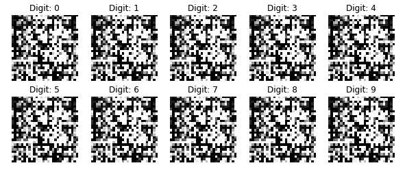
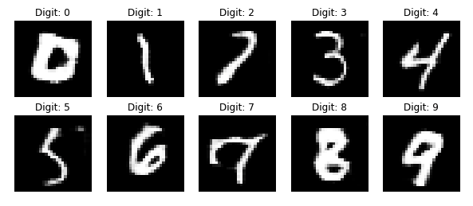
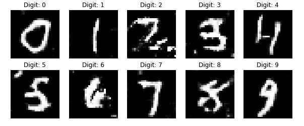

I've been reading the book _GANs in Action_ recently and playing aroung the models in it.
However, the [CGAN model](https://github.com/GANs-in-Action/gans-in-action/blob/master/chapter-8/Chapter_8_CGAN.ipynb)
example in Chapter 8 doesn't give satisfactory result in current version of tensorflow:



After some tuning I managed to get the final result:



Here's the modifications I made, hope it's useful to someone also reading this book. In short:

* Remove the `BatchNormalization` layers in discriminator
* In `build_cgan_generator`, instead of `Multiply`, `Concatenate` the random noise vector and label embedding
* Set `trainable=True` for `Embedding` layers in generator and discriminator

## BatchNormalization layer

The current discriminator implementation contains two layers of `BatchNormalization`:

```python
def build_discriminator(img_shape):
    model = Sequential()
    ...
    # Batch normalization
    model.add(BatchNormalization())

    # Leaky ReLU activation
    model.add(LeakyReLU(alpha=0.01))
    ...
    # Batch normalization
    model.add(BatchNormalization())
    ...
    return model
```

I found I could improve result only if I remove those two layers.

## Concatenate noise and label

Another change I had to make is changing the way label embedding is combined with noise vector z
from multipy:

```python
def build_cgan_generator(z_dim):
    ...
    # Element-wise product of the vectors z and the label embeddings
    joined_representation = Multiply()([z, label_embedding])
    generator = build_generator(z_dim)
    ...
```

to `Concatenation`:

```python
def build_cgan_generator(z_dim):
    ...
    joined_representation = Concatenate(axis=-1)([z, label_embedding])
    generator = build_generator(z_dim + z_dim)
    ...
```

Maybe it's because the label embedding pattern is not 'obvious' after multiply with random noise vector.

## Freeze Embedding layer

By default the `Embedding` layer has some parameters and is trainable. I found leaving it trainable
results in slightly blur result:



Setting trainalbe to False in Embedding layers improve the result, which I think  makes sense — the label embedding
is used as condition, and the condition should be fixed for a specific label.

## One-hot encode the label

This is not nessecary change. It's another way to to represent label and it's used in the Keras CGAN [example](https://keras.io/examples/generative/conditional_gan/). I tried on hot encoding and find it has similar result with `Embedding` layer. The corresponding
change are as follows(Adapted from Keras example):

Generator:
```python
def build_cgan_generator(z_dim):
    ...
    label_embedding = CategoryEncoding(num_tokens=num_classes, output_mode="one_hot")(label)
    joined_representation = Concatenate(axis=-1)([z, label_embedding])
    generator = build_generator(z_dim + 10)
    ...
```

Discriminator:
```python
def build_cgan_generator(z_dim):
    ...
    label_embedding = CategoryEncoding(num_tokens=num_classes, output_mode="one_hot")(label)
    label_embedding = layers.Lambda(lambda x: tf.repeat(x, repeats=np.prod(img_shape)))(label_embedding)
    label_embedding = layers.Lambda(lambda x: tf.reshape(x, (-1, img_shape[0], img_shape[1], num_classes)))(label_embedding)
    ...
```